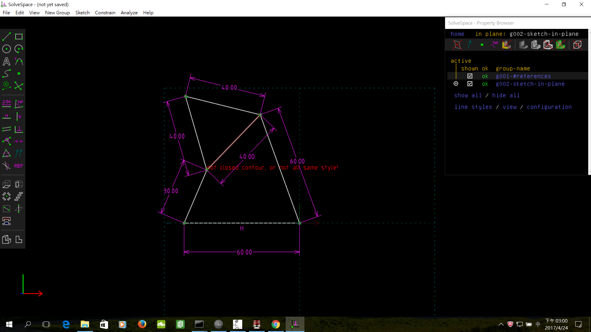

Title: Week 10
Date: 2017-04-26 22:00
Category: Course
Tags: 四連桿機構
Slug: Week 10
Author: 40423225

四連桿機構

<!-- PELICAN_END_SUMMARY -->

<h3>四連桿機構協同 Trace Point 查驗</h3>

Solvespace

<h3>影片</h3>

四連桿機構協同 Trace Point 查驗

<iframe src="https://player.vimeo.com/video/214780941" width="640" height="480" frameborder="0" webkitallowfullscreen mozallowfullscreen allowfullscreen></iframe>

四連桿四足行走機構

<iframe src="https://player.vimeo.com/video/214780991" width="640" height="480" frameborder="0" webkitallowfullscreen mozallowfullscreen allowfullscreen></iframe>

<h3><a href="https://vimeo.com/user60053503">個人影片區</a></h3>

<h3>心得</h3>

這是第十次上課，因為上次期中測驗做錯，所以這禮拜重弄。
